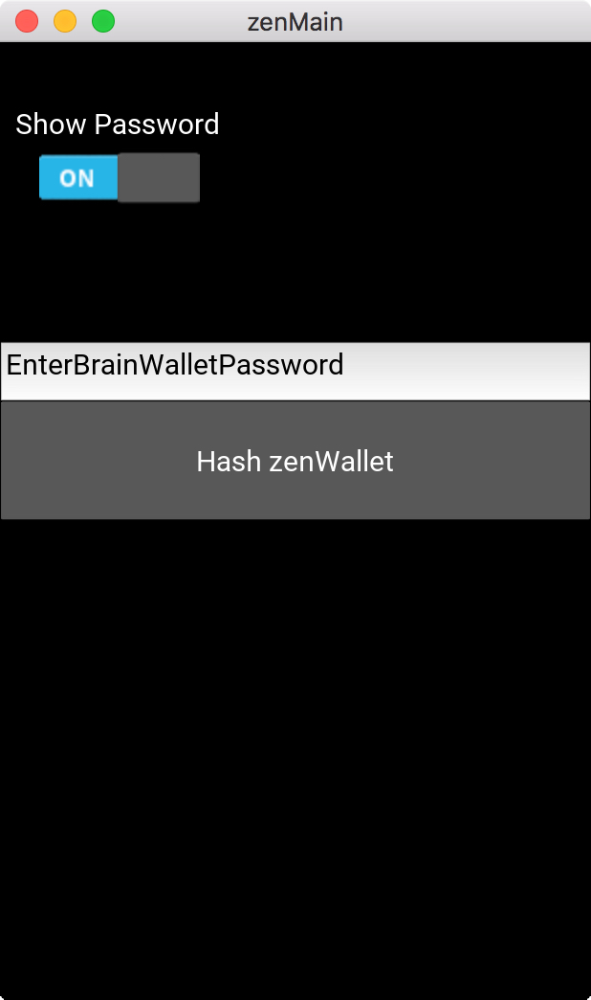
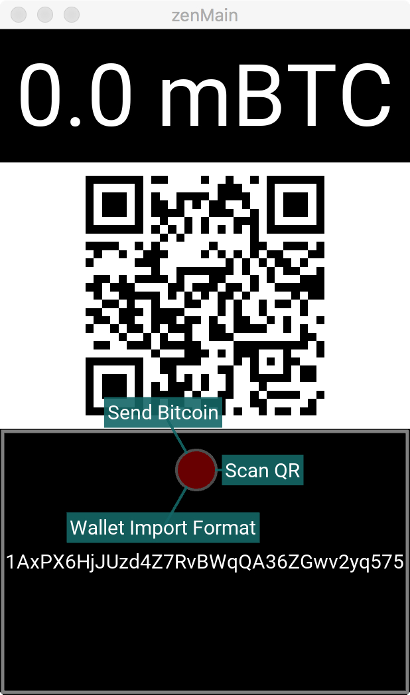
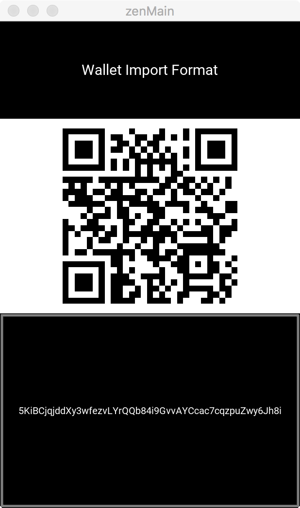

# zenWallet
A kivy based GUI utility for hashing brain wallets

Hashes a brain Wallet to its QR code address as well as QR code private key(WIF). 
Uses kivy for it's GUI. Uses pybitcointools for bitcoin operations. 

Run with:

```
$ kivy zenMain.py
```







##TO DO

Reimplement the whole thing with Libbitcoin.
